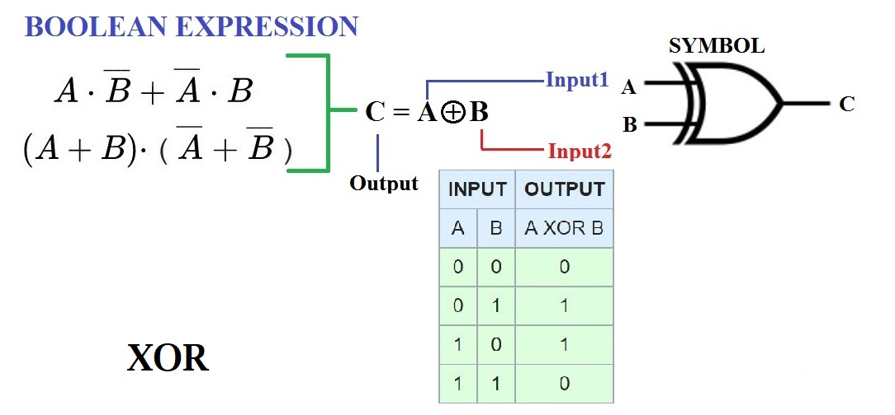

### INTRODUCTION 
<h3>Exclusive-OR (XOR):</h3>

XOR gate is formed by a combination of AND-OR-INVERT (AOI) logic. XOR gate (sometimes EOR, or EXOR and pronounced as Exclusive OR) is a digital logic gate that gives a true (1 or HIGH) output when the number of true inputs is odd. An XOR gate implements an exclusive or from mathematical logic; that is, true output results if one, and only one, of the inputs to the gate is true. If both inputs are false (0/LOW) or both are true false output results. XOR represents the inequality function, i.e., the output is true if the inputs are not alike otherwise the output is false. A way to remember XOR is "must have one or the other but not both".
 

The three-variable XOR is equal to 1 if only one variable is equal to 1 or if all three variables are equal to 1. With three or more variables an odd number of variables must be equal to 1.

 

<figure>
    
    <figcaption>schematic symbols for XOR gates</figcaption>
</figure>

<figure style="text-align: center; margin: 1rem;">
    
</figure>

 

<h3>Faults in logical circuits:</h3>
            

Fault is a physical defect within a circuit or a system that may or may not cause a system failure. It is a logic-level abstraction of a physical defect and is used to describe the change in the logic function of a device caused by the defect.
 

Logical errors are used to represent physical errors. They simplify the error analysis process and reduce the number of errors. The most common model used for logical faults is the "single stuck-at fault". It assumes that a fault in a logic gate results in one of its inputs or the output being fixed to either a logic 0 (stuck at-0) or a logic 1 (stuck-at-1). Stuck-at-0 and stuck-at-1 faults are often abbreviated to s-a-0 and s-a-1 respectively, and the abbreviations will be adopted here.
 
            
            
<h3> Stuck-at fault (SAF):</h3>

A stuck-at fault is a particular fault model used by fault simulators and tools to mimic a manufacturing defect within an integrated circuit. Individual signals and pins are assumed to be stuck at Logical '1', '0', and 'X'. For example, an input is tied to a logical 1 state during test generation to assure that a manufacturing defect with that type of behavior can be found with a specific test pattern. Likewise, the input could be tied to a logical 0 to model the behavior of a defective circuit that cannot switch its output pin.

 
<figure>
    
    <figcaption>A,B,C,D,E are diffrent points in the circuit. They can be stuck at 0 or 1 due to the fault.
    </figcaption>
</figure>

    Output = X⊕Y⊕Z

            
<h3>Truth Tables:</h3>            
<figure style="margin-bottom: 2rem;">
    
    <figcaption>figure: Truth Table for 3-Input Odd Function</figcaption>
</figure>
