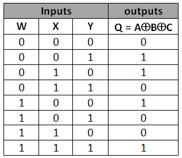

### Introduction

### Exclusive-OR (XOR) 

The XOR gate, also known as Exclusive OR (sometimes written as EOR or EXOR), is constructed using AND-OR-INVERT (AOI) logic. It produces a HIGH (1) output when the number of HIGH inputs is odd. This means the output is true only if exactly one of the inputs is true, and false if both inputs are the same (either both 0 or both 1). XOR essentially checks for inequality between inputs. A simple way to remember XOR is: "one or the other, but not both."
 

For three inputs, the XOR gate outputs 1 when either exactly one input is 1 or when all three inputs are 1. In general, for three or more inputs, the output is 1 if an odd number of the inputs are 1.

 

<figure>
    
    <figcaption>Schematic symbols for XOR gates</figcaption>
</figure>   

<figure style="text-align: center; margin: 1rem;">
    
</figure>

 

### Faults in logical circuits
            

 A fault is a physical defect in a circuit or system that may lead to malfunction. It is typically represented at the logic level to simplify analysis, serving as an abstract model of how a physical defect alters the circuit’s logical behavior.

To streamline error detection and reduce complexity, logical errors are used to represent physical faults. The most widely used model is the <strong>single stuck-at fault</strong>, where a fault causes a signal (input or output) to be permanently fixed at logic 0 (stuck-at-0 or s-a-0) or logic 1 (stuck-at-1 or s-a-1).

            
### Stuck-at fault (SAF) 

This model simulates manufacturing defects by assuming certain signals or pins are permanently stuck at a logical '1', '0', or 'X'. For instance, an input may be assumed stuck at logic 1 during test generation to ensure a test pattern can detect a defect with that behavior. Similarly, it could be stuck at logic 0 to simulate a fault that prevents proper signal switching.

<figure>
    
    <figcaption>A,B,C,D,E are diffrent points in the circuit. They can be stuck at 0 or 1 due to the fault.
    </figcaption>
</figure>

    Output = X⊕Y⊕Z

            
#### Truth Table           
<figure style="margin-bottom: 2rem;">
    
    <figcaption>Truth Table for 3-Input Odd Function</figcaption>
</figure>
